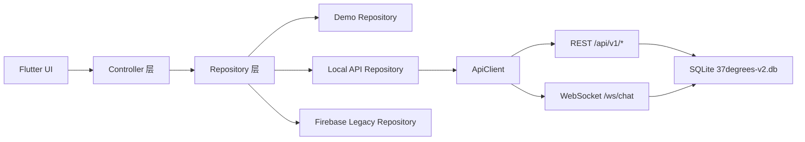
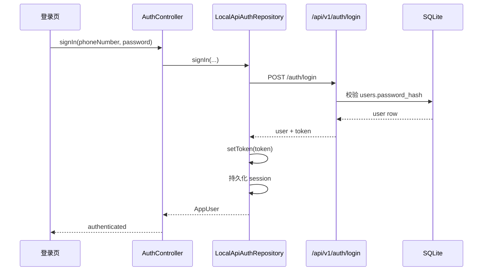
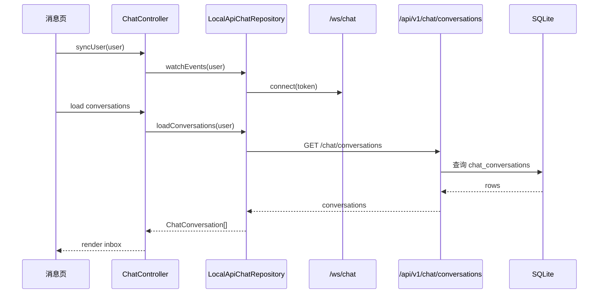
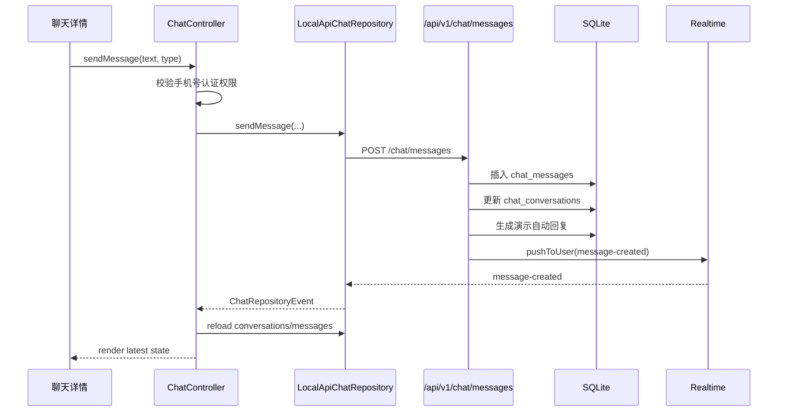

# 37° 现阶段数据交互文档

更新日期: `2026-04-02`

适用代码基线:

- 分支: `master`
- 提交: `2da139a`

## 1. 当前架构总览

当前代码不是单一数据源，而是“三层运行模式 + 两类仓库 + 一套本地 API”的结构。

## 2. 启动与模式选择

当前启动入口:

- [main.dart](/D:/Codex/lib/main.dart)
- [app.dart](/D:/Codex/lib/app.dart)
- [app_bootstrap.dart](/D:/Codex/lib/src/core/bootstrap/app_bootstrap.dart)

启动顺序:

1. `main()` 调用 `AppBootstrap.initialize()`
2. 读取 `APP_MODE`
3. 读取 `LOCAL_API_BASE_URL`
4. 如果模式为 `localApi`
5. 先通过 `ApiClient.ping()` 请求 `/health`
6. 如果本地 API 可达:
   - 认证仓库使用 `LocalApiAuthRepository`
   - 聊天仓库使用 `LocalApiChatRepository`
7. 如果本地 API 不可达:
   - 自动回退到 `DemoAuthRepository`
   - 自动回退到 `DemoChatRepository`
8. 如果模式为 `firebaseLegacy`
   - 尝试初始化 Firebase
   - 不可用则回退 demo

### 2.1 环境变量

当前支持:

| 变量 | 默认值 | 说明 |
| --- | --- | --- |
| `APP_MODE` | `localApi` | 当前运行模式 |
| `LOCAL_API_BASE_URL` | `http://127.0.0.1:3001` | 本地 API 基地址 |

## 3. 认证链路

当前主认证仓库:

- [local_api_auth_repository.dart](/D:/Codex/lib/src/features/auth/data/local_api_auth_repository.dart)

控制层:

- [auth_controller.dart](/D:/Codex/lib/src/features/auth/presentation/auth_controller.dart)

### 3.1 登录链路

### 3.2 注册链路

当前注册不是纯一步提交，而是“先发本地调试验证码，再注册”。

实际顺序:

1. 前端调用 `/api/v1/auth/sms/send`，`purpose=register`
2. 服务端写入 `sms_codes`
3. 前端直接读取返回的 `debugCode`
4. 再调用 `/api/v1/auth/register`
5. 服务端校验验证码
6. 创建 `users`
7. 创建默认隐私设置 `chat_user_privacy_settings`
8. 创建当前设备会话 `user_device_sessions`
9. 返回 `user + token`

### 3.3 会话持久化

当前本地 API 模式下，Flutter 端会把登录态持久化到本地:

- 存储键: `local_api_auth_session_v1`
- 内容:
  - `token`
  - `user`

存储位置由:

- [json_preferences_store.dart](/D:/Codex/lib/src/core/persistence/json_preferences_store.dart)

负责。

### 3.4 手机号认证链路

真实交互顺序:

1. 账号中心发起手机号认证
2. 前端调用 `/api/v1/auth/sms/send`，`purpose=verify-phone`
3. 返回 `sessionId + debugCode + expiresAt`
4. `AuthController` 暂存 `pendingPhoneSession`
5. 用户输入验证码
6. 前端调用 `/api/v1/auth/phone/confirm`
7. 后端更新:
   - `users.phone_number`
   - `users.masked_phone_number`
   - `users.phone_status`
   - `users.phone_verified_at`
8. 返回更新后的 `user`

### 3.5 实名与本人认证链路

当前实名与本人认证都属于“边界已打通，结果自动通过”的状态。

实名认证:

1. 前端调用 `/api/v1/reviews/identity`
2. 后端写入 `identity_verification_requests`
3. 后端同步更新 `users.identity_status`
4. 后端写入 `admin_audit_logs`
5. 返回新 `user`

本人头像认证:

1. 前端调用 `/api/v1/reviews/face`
2. 后端写入 `face_verification_requests`
3. 后端同步更新 `users.face_status`
4. 后端写入 `admin_audit_logs`
5. 返回新 `user`

## 4. 资料编辑链路

相关页面:

- [account_screen.dart](/D:/Codex/lib/src/features/account/presentation/account_screen.dart)

资料编辑包含:

1. 基础资料
2. 视频介绍
3. 作品列表

当前交互模式:

- 所有资料编辑先在底部 Sheet 中完成
- 最终统一通过 `AuthController.updateProfile()` 进入仓库
- 本地 API 仓库调用 `/api/v1/users/me/profile`

### 4.1 特殊规则

当前后端已经实现:

1. 修改 `avatarKey` 时:
   - 自动重置 `face_status`
   - 自动清空 `face_match_score`
2. 修改 `gender` 时:
   - 只有当前值为 `undisclosed` 才允许首次写入
3. 更新 `works` 时:
   - 当前采用整表替换策略
   - 先删除原作品
   - 再重建新作品列表

## 5. 聊天链路

当前聊天仓库:

- [local_api_chat_repository.dart](/D:/Codex/lib/src/features/chat/data/local_api_chat_repository.dart)

控制层:

- [chat_controller.dart](/D:/Codex/lib/src/features/chat/presentation/chat_controller.dart)

页面层:

- [chat_screen.dart](/D:/Codex/lib/src/features/chat/presentation/chat_screen.dart)

### 5.1 会话列表加载

### 5.2 种子会话逻辑

当当前用户第一次访问聊天列表时:

1. 后端会检测 `chat_conversations` 是否为空
2. 如果为空，则自动生成种子会话
3. 包括:
   - `37° 向导`
   - 私聊示例
   - 热聊示例
   - 关注我的
   - 我关注的

这一步发生在:

- `GET /api/v1/chat/conversations`

内部。

### 5.3 发消息链路

### 5.4 消息权限规则

当前权限逻辑:

1. 如果会话属于系统引导会话
   - 允许发送
2. 如果会话不是系统引导会话
   - 要求 `user.canSendPrivateMessages == true`
   - 本质上要求 `phoneStatus == verified`

当前前后端规则是一致的:

- 前端 `ChatController` 先拦一次
- 后端 `POST /api/v1/chat/messages` 再拦一次

### 5.5 WebSocket 行为

当前 WebSocket 不是传完整消息体，而是传“刷新信号”。

也就是说:

1. 后端通过 `/ws/chat` 推送事件
2. 前端仓库收到事件后发出 `ChatRepositoryEvent`
3. `ChatController` 收到事件后重新调用 REST 拉会话和消息

好处:

- 逻辑简单
- 排序和未读数始终以数据库为准

代价:

- 每次事件都要再走一次 REST 拉取

## 6. 广场与圈子的数据边界

这是当前最容易被误解的地方。

### 6.1 广场

当前移动端页面:

- [home_screen.dart](/D:/Codex/lib/src/features/home/presentation/home_screen.dart) 中的 `PlazaTab`

当前数据来源:

- 本地静态数组 `_profiles`
- 本地筛选状态 `_selectedRegion / _selectedAge / _selectedGender`

当前结论:

- 后端已经有 `/api/v1/square/*`
- 但 Flutter 广场页面当前没有接 API

### 6.2 圈子

当前移动端页面:

- [home_screen.dart](/D:/Codex/lib/src/features/home/presentation/home_screen.dart) 中的 `CircleTab`
- [home_screen.dart](/D:/Codex/lib/src/features/home/presentation/home_screen.dart) 中的 `_CreateCirclePostScreen`

当前发布页字段:

1. 文案
2. 地址
3. 图片
4. 语音
5. 作品

当前数据来源:

- 圈子列表来自本地 `_posts`
- 发布成功后直接插入本地 `_posts`
- 草稿保存在内存 `_draftCache`

当前结论:

- 后端已经有 `/api/v1/circle/*`
- Flutter 圈子页面当前还没有真正提交到后端

## 7. 设置、通知、设备、黑名单的数据边界

### 7.1 账号中心设置卡片

当前界面中的几个开关:

- 优先展示已认证用户
- 接收系统通知
- 开放附近曝光

当前状态:

- 仅在页面内 `setState`
- 还没有真正写回 `/api/v1/users/me/settings` 或 `/api/v1/chat/privacy`

### 7.2 通知中心

后端已经有:

- `/api/v1/notifications`

当前移动端状态:

- 没有独立通知页
- 首页广场中的“平台系统通知”是本地展示文案，不是后端通知接口

### 7.3 设备管理 / 黑名单 / 注销

后端已经有:

- `GET /users/me/devices`
- `POST /users/me/devices/:deviceId/revoke`
- `GET /users/me/blacklist`
- `POST /users/me/blacklist`
- `DELETE /users/me/blacklist/:targetUserId`
- `POST /users/me/cancel`

当前移动端状态:

- 账号中心暂无完整页面入口

## 8. 上传链路当前状态

后端上传能力:

- 单文件
- 多文件
- 头像
- 视频
- 语音

当前移动端状态:

- 聊天里的图片/语音/视频按钮仍是演示快捷消息
- 圈子发布页中的图片/语音/作品也是前端模拟素材选择
- 没有真实文件选择器、没有上传进度条、没有断点续传

## 9. 本地存储与持久化

当前不同模式的持久化边界如下:

| 数据 | localApi 模式 | demo 模式 |
| --- | --- | --- |
| 登录态 | Flutter 本地保存 token + user | Flutter 本地保存 demo 用户 |
| 会话数据 | SQLite 后端保存 | SharedPreferences / JSON 偏本地 |
| 消息数据 | SQLite 后端保存 | 本地持久化 |
| 广场数据 | 前端静态 | 前端静态 |
| 圈子数据 | 前端内存 | 前端内存 |
| 草稿 | 聊天草稿内存保存 | 聊天草稿内存保存 |

注意:

- 当前聊天草稿不是永久持久化，只在 App 当前运行期间保存在 `ChatController._drafts`
- 当前圈子草稿也只是页面级内存缓存，不写数据库

## 10. 当前数据库与业务映射

当前最重要的数据表映射关系:

| 业务 | 主要表 |
| --- | --- |
| 用户主档 | `users` |
| 短信验证码 | `sms_codes` |
| 第三方账号 | `user_social_accounts` |
| 设备会话 | `user_device_sessions` |
| 实名认证 | `identity_verification_requests` |
| 本人头像认证 | `face_verification_requests` |
| 用户作品 | `user_works` |
| 会话 | `chat_conversations` |
| 会话成员 | `chat_conversation_members` |
| 消息 | `chat_messages` |
| 聊天隐私 | `chat_user_privacy_settings` |
| 黑名单 | `chat_blacklist_entries` |
| 圈子动态 | `circle_posts` |
| 圈子附件 | `circle_post_media` |
| 圈子评论 | `circle_comments` |
| 动态举报 | `circle_reports` |
| 系统通知 | `system_notifications` |
| 用户通知 | `user_notifications` |
| 广场 Banner | `square_banner_items` |
| 保存的广场筛选 | `saved_square_filters` |
| 后台日志 | `admin_audit_logs` |

## 11. 当前最重要的边界结论

为了避免误判，现阶段要记住 5 件事:

1. 认证主链、账号资料、聊天链路已经真正接到本地 API
2. 广场和圈子 UI 还主要是前端示意数据，不是后端真数据
3. 后台 API、通知 API、上传 API 已经存在，但移动端未全面接入
4. WebSocket 当前只承担“刷新信号”，不是完整消息总线
5. 当前版本已经具备继续扩开发的稳定底座，但还没进入“所有模块全联通”的状态

## 12. 2026-04-09 数据交互补充

### 12.1 圈子详情链路

1. 圈子列表点击卡片后，移动端会把 `postId` 传入详情页
2. 详情页初始化时调用 `CircleController.loadPostDetail(postId)`
3. `localApi` 模式下，请求 `GET /api/v1/circle/posts/:postId`
4. `demo` 模式下，从本地持久化评论缓存读取 `CirclePostDetail`

### 12.2 评论链路

1. 用户输入评论后，移动端调用 `CircleController.addComment`
2. 若存在 `parentCommentId`，则按回复评论处理
3. `localApi` 模式下，请求 `POST /api/v1/circle/posts/:postId/comments`
4. 评论成功后会重新拉取详情，并同步更新列表卡片上的评论数

### 12.3 举报链路

1. 用户在详情页选择举报原因后，移动端调用 `CircleController.reportPost`
2. `localApi` 模式下，请求 `POST /api/v1/circle/posts/:postId/reports`
3. `demo` 模式下，仅记录本地举报条目用于流程验证
